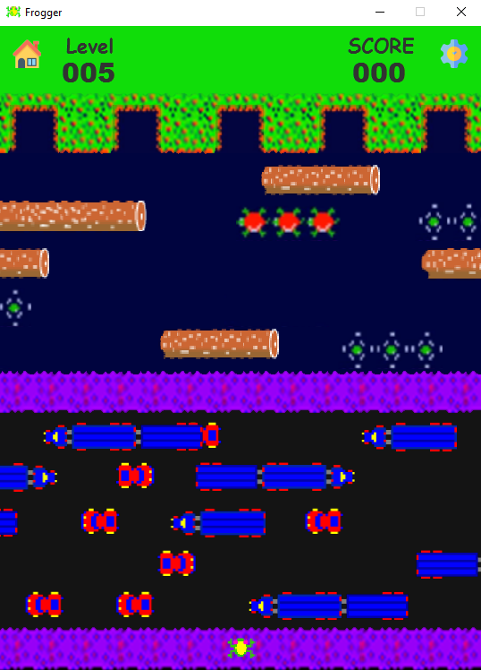

# Frogger :frog:

[frogger](https://en.wikipedia.org/wiki/Frogger) is an arcade game developed  in 1980's by [Konami](https://en.wikipedia.org/wiki/Konami) a japanese company.
This will be a refurbished version of frogger.
The focus of this repo will mainly be improving gameplay and adding features to the game while still keeping the original theme intact.

<p align="center">
  
</p>

## Content
- [Installation](#installation)
- [Usage](#usage)
    - [How to play](#how-to-play)
    - [Controls](#controls)
- [Features](#installation)
    - [Gameplay](#gameplay)
    - [Modifications](#modifications)
- [Implementations](#implementations)
    - [GUI](#gui)
        - [GUI Hierarchy](#gui-hierarchy)
    - [Controllers](#controllers)
        - [Controllers Hierarchy](#controllers-hierarchy)
    - [Major Changes](#major-changes)
    - [Bug Fixes](#bug-fixes)
- [Design Patterns](#design-patterns)
- [Credits](#credits)
- [License](#license)

## Installation
```

```

## Usage

### How to play
- Your main objective is to bring the frog back to its home, while not being ran over by trucks or drowned on its way home.
- Numbers of respawn chance will be given.
- Different score will be awarded based on time spent of each frog.

    #### Controls
    keys | actions
    ----|--------
    W | UP
    A | LEFT
    S | DOWN
    D | RIGHT
    
### How to create new level
1. Find com.tsb.frogger.world.levels package
2. Create a new class e.g. Level_100.java in this package
3. All level designing will be written in this loadLevel method
    ```java
    package com.tsb.frogger.world.levels;
    
    import com.tsb.frogger.core.ConstantData;
    import com.tsb.frogger.world.LoadComponents;
    import com.tsb.frogger.world.MyStage;
    
    public class Level_100 implements LevelBase{
    
        @Override
        public void loadLevel() {
            //load components here
        }
    }
    ```
4. now adding actors, for example adding a long log
   
    ```java
    // LoadComponents.addActor(layout x, layout y, moving direction & speed);
    LoadComponents.addLongLog(0, ConstantData.LAYOUT_Y_ACTOR[0][1], -0.75);
    ```
    Layout x is fully customizable, however layout y is defined in constant as 
    ```java
    ConstantData.LAYOUT_Y_ACTOR[0][index]
    ```
    Here is all the available actors in table 1, simply replace above method with one of these e.g addShortLog.  
    All possible index and corresponding location in the game is in table 2, assign shown index to above constant array for position.
      
   <table align="center">
   <tr>
    <th>Table 1</th>
    <th>Table 2</th>
   </tr>
   <tr>
   <td>
   
   | Actors     | Type     |
   |------------|----------|
   | ShortLog   | pathway  |
   | MediumLog  | pathway  |
   | LongLog    | pathway  |
   | WetTurtle  | both     |
   | Turtle     | pathway  |
   | Car        | obstacle |
   | ShortTruck | obstacle |
   | LongTruck  | obstacle |
   
   </td>
   <td>
   
   | Index | Position |
   |-------|----------|
   | 0     | End      |
   | 1~5   | River    |
   | 6     | Grass    |
   | 7~11  | Road     |
   | 12    | Start    |
   
   </td>
   </tr>
   </table>
   
## Features
### Gameplay
- Create personal account username for high score storing
- Browse personal high score
- Show game info
- Change Game settings
- Select Level & play game
- 10 levels is available
- The higher the level is the harder the difficultly is
- Extra points will be added based on time taken every round where maximum possible score is 900
- Able to proceed to the next level after completing each level

### Modifications
- Create new level easily without messing with inner logic

## Implementations
### Views
Interactive screens are added using fxml and controllers to adhere MVC pattern.
#### GUI Hierarchy
- Username managing screen
    - Main menu screen
        - Game info screen
        - High score screen
        - Option settings screen
        - Level selection screen
            - game screen
            - victory screen

### Controllers
ScreenController class and ControlledScreen interface are introduced to eliminate many to many relationships between screens so that screens are handled in a centralized form with a relation of one to many.
This framework allows new fxml screens to be added easily.
#### Controllers Hierarchy
- Launcher (application)
    - ScreenController (main controller)
        - ControlledScreens (interface)
            - Controller1 (fxml controllers)
            - Controller2
            - ...

### Major Changes
- Added Sound class for audio clip playing and music playing
- Added ConstantData class for assets path and game constant
- Added RuntimeData class for runtime data references 
- Added Player, FileGame, FileScore and FileUsername for the username and high score file reading and writing
- Added LevelNotFoundException a custom Exception class for error handling
- Added Game, LoadComponents, LevelSelector and Launcher, refactored from the original main class.
- Added LevelBase interface for linking up all custom-made levels.
- Categorized assets into images, sounds, views (fxml assets), saves (serialized objects) and styles (css)
- Categorized classes into packages of controllers, core, utils and worlds
- Refactored Animal actor horrifying nested if conditions using switches
- Optimized in game score display from image view adding to label updating
- Removed Digit actor
- Removed Background actor and move its functionality to LoadComponents
- Added GodAnimal actor that wins instantly for debugging purposes
- Added several fxml screens with its controller controlled by an instance of ScreenController in Launcher
- Linked all the functionalities from models to controller to views
- Slightly shrink down the size of the window

### Bug Fixes
- Fixed actor image view inconsistent shifting due to different image size of different actors
- Fixed fast frog movement bug for long pressed key
- Fixed a bug where all wet turtles sink into water at the same time

## Design Patterns


## Credits
- Icons made by <a href="https://www.flaticon.com/authors/freepik" title="Freepik">Freepik</a> from <a href="https://www.flaticon.com/" title="Flaticon"> www.flaticon.com </a>
- Icons made by <a href="https://www.flaticon.com/authors/vectors-market" title="Vectors Market">Vectors Market</a> from <a href="https://www.flaticon.com/" title="Flaticon"> www.flaticon.com </a>

## License