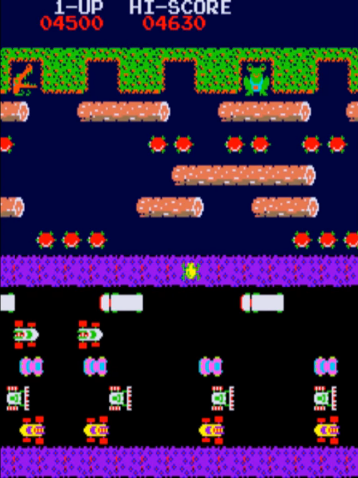

# Frogger :frog:

[frogger](https://en.wikipedia.org/wiki/Frogger) is an arcade game developed  in 1980's by [Konami](https://en.wikipedia.org/wiki/Konami) a japanese company.
This will be a reimplementation and refurbished version of frogger.
The focus of this repo will mainly be improving gameplay and adding features to the game while still keeping the original theme intact.

<p align="center">
  
</p>

## Installation
```

```
## How to play
- Your main objective is to bring the frog back to its home, while not being ran over by trucks or drowned on its way home. 
- Numbers of respawn chance will be given. 
- Different score will be awarded based on time spent of each frog.
### Controls
keys | actions
----|--------
W | UP
A | LEFT
S | DOWN
D | RIGHT

## Credits
- Icons made by <a href="https://www.flaticon.com/authors/freepik" title="Freepik">Freepik</a> from <a href="https://www.flaticon.com/" title="Flaticon"> www.flaticon.com </a>
- Icons made by <a href="https://www.flaticon.com/authors/vectors-market" title="Vectors Market">Vectors Market</a> from <a href="https://www.flaticon.com/" title="Flaticon"> www.flaticon.com </a>