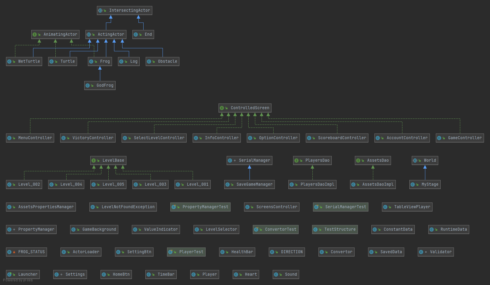

# Frogger :frog:

[frogger](https://en.wikipedia.org/wiki/Frogger) is an arcade game developed in the 1980s by [Konami](https://en.wikipedia.org/wiki/Konami) a japanese company.
This will be a refurbished version of frogger.
The focus of this repo will mainly be improving gameplay and adding features to the game while still keeping the original theme intact.

<p align="center" float="left">
  
  
  
  
</p>
<p align="center" float="left">
  
  
  
  
</p>

## Content
- [Installation](#installation)
- [Usage](#usage)
    - [How to play](#how-to-play)
    - [How to create new level](#how-to-create-new-level)
- [Features](#features)
- [Implementations](#implementations)
    - [Views](#views)
        - [GUI Hierarchy](#gui-hierarchy)
    - [Controllers](#controllers)
        - [Controllers Hierarchy](#controllers-hierarchy)
    - [Changes](#changes)
    - [Fixes](#fixes)
- [Design Patterns](#design-patterns)
- [Credits](#credits)

[comment]: <> (- [License]&#40;#license&#41;)

## Installation
### Wihtout IDE
1. Clone this repo
2. Unzip the folder
3. In your command prompt or your terminal use `cd $YOUR_PATH` navigate into cloned folder
4. Type in `gradlew :run` or `./gradlew :run` depending on your OS to build and run the game, 
   see also [gradle command line interface](https://docs.gradle.org/current/userguide/command_line_interface.html)

### Intellij
1. Clone this repo
2. Unzip the folder
3. Navigate into the folder then open `build.gradle` using intellij and open as project, see also [import gradle project in intellij](https://www.jetbrains.com/help/idea/gradle.html#gradle_import_project_start)

[comment]: <> (### Method 2)

[comment]: <> (1. Download Released jar)

[comment]: <> (2. Download JavaFx)

[comment]: <> (3. In command prompt use `cd $YOUR_PATH` navigate into folder)

[comment]: <> (4. Run this code where specifying your own javafx/lib folder path into `$PATH_TO_JavaFX`:)

[comment]: <> (   ```shell)

[comment]: <> (   java --module-path {$PATH_TO_JavaFX} --add-modules javafx.controls,javafx.fxml,javafx.media -jar frogger-1.0.jar)

[comment]: <> (   ```)

[Back to content](#content)  

## Usage

### How to play
- Your main objective is to bring the frog back to its home, while not being run over by trucks or drowned on its way home.
- Numbers of respawn chances will be given.
- Different score will be awarded based on time spent of each frog.

    #### Controls
    keys | actions
    ----|--------
    W | UP
    A | LEFT
    S | DOWN
    D | RIGHT
    
[Back to content](#content)  
    
### How to create new level

[Here](HowToAddLevel.md) is the method to add new levels

[Back to content](#content)  

## Features
### Gameplay
- Create personal account username for high score storing
- Browse personal high score
- Show game info
- Change Game settings
- 5 levels are available
- The higher the level is the harder the difficultly is
- Timer count down for extra fun
- Extra points will be added based on time taken every round
- Able to proceed to the next level after completing each level

### Modifications
- Create new level easily by extending class   

[Back to content](#content)

## Implementations
### Views
Interactive screens are added using fxml and controllers to adhere MVC pattern.
#### GUI Hierarchy
- Username managing screen
    - Main menu screen
        - Game info screen
        - High score screen
        - Option settings screen
        - Level selection screen
            - game screen
            - victory screen

### Controllers
ScreenController class and ControlledScreen interface are introduced to eliminate many to many relationships between screens so that screens are handled in a centralized form with a relation of one to many.
This framework allows new fxml screens to be added easily.
#### Controllers Hierarchy
- Launcher (application)
    - ScreenController (main controller)
        - ControlledScreens (interface)
            - Controller1 (fxml controllers)
            - Controller2
            - ...

### Changes
- Removed Digit actor
- Removed Background actor and move its functionality to LoadComponents
- Added ConstantData class for game constants
- Added RuntimeData class for data references (game saves are loaded here)
- Added Game, ActorLoader, LevelSelector and Launcher, refactored from the original main class.
- Added LevelBase interface for linking up all custom-made levels.
- Added LevelNotFoundException a custom Exception class for error handling
- Added Sound class for audio clip playing and music playing
- Added SaveGameManager that extends FileManager for the use of loading and storing save file
- Added Player, SavedGame, settings as serializable data object 
- Added data access objects (DAO) for Player and assets
- Added assets.properties as central assets' path storage
- Categorized classes into package of controllers, core, utils and worlds
- Categorized asset files into directories of images, sounds, views (fxml assets) and styles (css)
- Refactored Actor class into IntersectingActor class, ActingActor class, AnimatingActor Interface
- Refactored Turtle, WetTurtle and Frog to extends ActingActor and implements AnimatingActor
- Refactored End actor to extends IntersectingActor and remove inherited unused methods
- Refactored the rest of the actors extend from ActingActor
- Refactored in game score display from image view appending to label updating
- Added GodAnimal actor that wins instantly for debugging purposes
- Added several fxml screens with its controller controlled by an instance of ScreenController in Launcher
- Slightly shrink down the size of the window

### Fixes
- Fixed actor image view inconsistent shifting due to different image size of different actors
- Fixed fast frog movement bug for long pressed key
- Fixed a bug where all wet turtles sink into water at the same time

[Back to content](#content)  

## Design Patterns

<p align="center">
  
</p>   

- **MVC Pattern**  
  Using models, views(fxml,css), controllers for the entire GUI

- **Front Controller Pattern**  
  ScreensController act as a centralized views request handling class and all other controllers are requested through ControlledClass Interface

- **Factory Pattern**  
  Used in level base (interface) and levels (class) where the interface act as the general level and levelSelector instantiate one of the level (sub-class) and cast it to level base

- **Singleton Pattern**  
  Used across this project such as Sound class, Convertor, Validator class etc.

- **Facade Pattern**  
  Used in the LoadComponents class, where it wraps a complicated subsystem (actors) with a simpler interface.
  
- **DAO Pattern**  
  SaveGame Data structure Loaded from save file act as the data, uses PlayerDao implemented by PlayerDaoImpl to fetch data from SavedGame Data Structure

[Back to content](#content)

## Credits
- Icons made by <a href="https://www.flaticon.com/authors/freepik" title="Freepik">Freepik</a> from <a href="https://www.flaticon.com/" title="Flaticon"> www.flaticon.com </a>
- Icons made by <a href="https://www.flaticon.com/authors/vectors-market" title="Vectors Market">Vectors Market</a> from <a href="https://www.flaticon.com/" title="Flaticon"> www.flaticon.com </a>

[comment]: <> (## License)

[comment]: <> (All code found in this repository is licensed under)

[comment]: <> ([Back to content]&#40;#content&#41;  )
